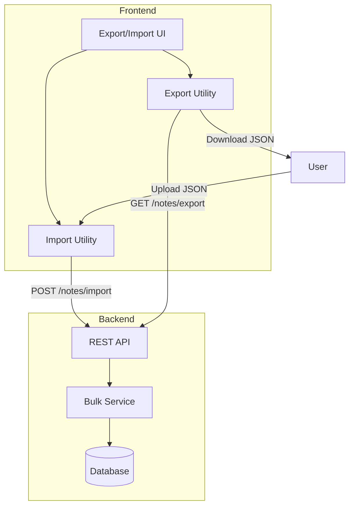
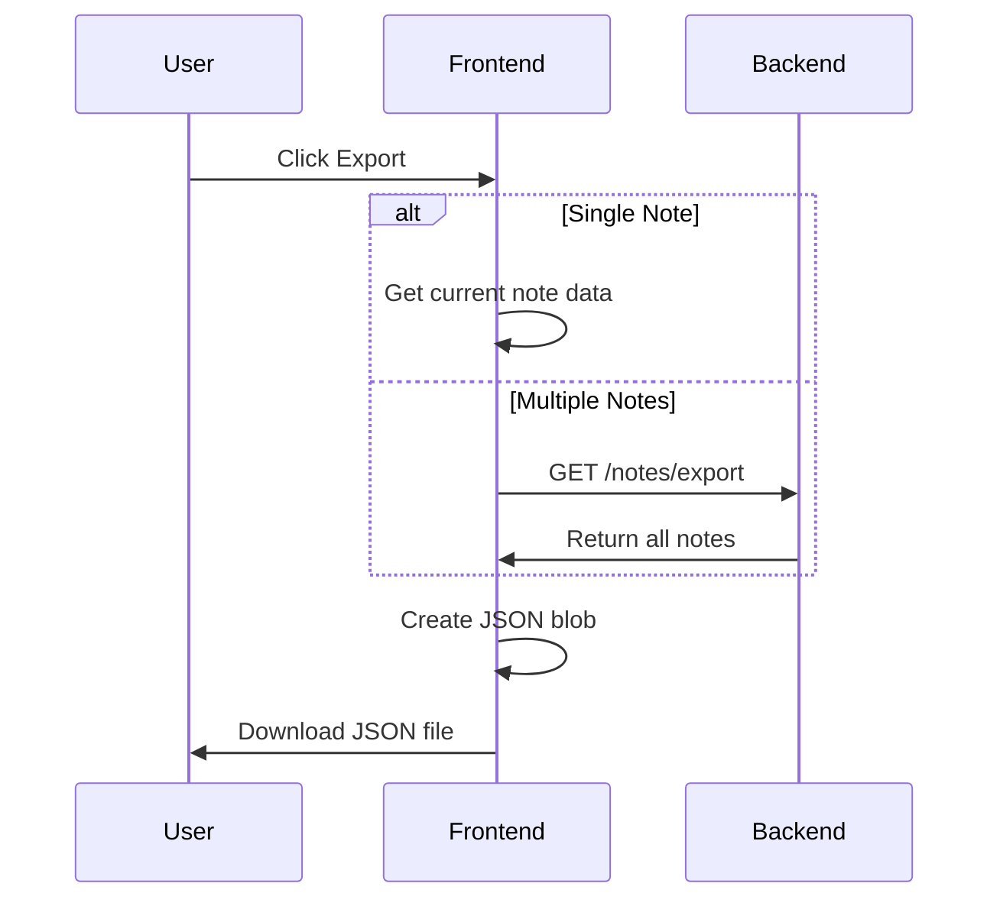
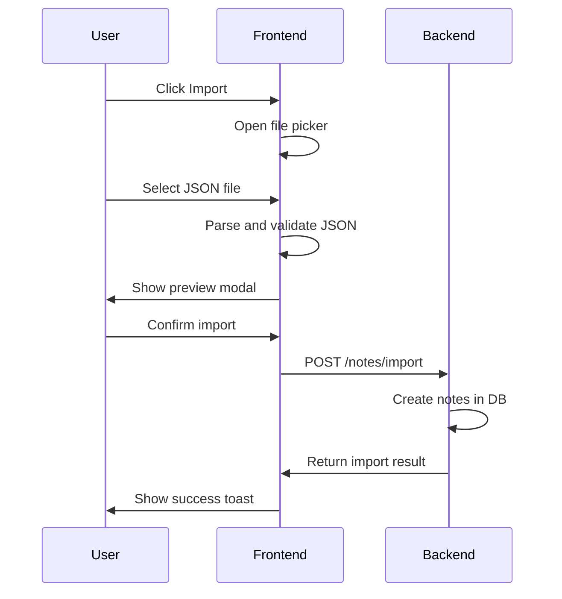

# Import/Export Notes Feature Plan

## Overview

This document outlines the implementation plan for adding import/export functionality to the NoteNext application. Users will be able to export notes to files and import them back, with support for both single and multiple notes.

## File Format Recommendation: JSON

**Why JSON is the best choice:**

| Format      | Pros                                                                                         | Cons                                     |
| ----------- | -------------------------------------------------------------------------------------------- | ---------------------------------------- |
| **JSON** ✅ | Structured data, preserves all note fields, easy to parse, supports arrays, widely supported | Less human-readable than plain text      |
| Plain Text  | Human readable                                                                               | Loses structure, no metadata support     |
| Markdown    | Good for content                                                                             | Loses note metadata like ID and position |
| CSV         | Tabular format                                                                               | Not suitable for rich text content       |

**JSON Structure:**

```json
{
  "version": "1.0",
  "exportedAt": "2026-02-18T07:30:00.000Z",
  "notes": [
    {
      "id": "note-uuid",
      "title": "My Note Title",
      "content": "Note content here...",
      "positionAt": 1234567890
    }
  ]
}
```

## Architecture

### Approach: Backend + Frontend

**Why this approach:**

- Backend handles bulk operations efficiently
- Proper validation and error handling
- Consistent with existing API patterns
- Better performance for large imports



## Implementation Details

### Backend Changes

#### 1. New DTOs

**File:** `internal/dtos/note_dto.go`

```go
type ExportNotesResponse struct {
    Version     string          `json:"version"`
    ExportedAt  string          `json:"exportedAt"`
    Notes       []NoteResponse  `json:"notes"`
}

type ImportNotesRequest struct {
    Notes []ImportNoteItem `json:"notes"`
}

type ImportNoteItem struct {
    Title       string `json:"title"`
    Content     string `json:"content"`
    PositionAt  int64  `json:"positionAt,omitempty"`
}

type ImportNotesResponse struct {
    Imported    int      `json:"imported"`
    Skipped     int      `json:"skipped"`
    NoteIds     []string `json:"noteIds"`
}
```

#### 2. New Service Methods

**File:** `internal/services/note_service.go`

```go
func (s *NoteService) ExportNotes(ctx *gin.Context) (*dtos.ExportNotesResponse, error)
func (s *NoteService) ImportNotes(ctx *gin.Context, req *dtos.ImportNotesRequest) (*dtos.ImportNotesResponse, error)
```

#### 3. New Handler Methods

**File:** `internal/api/handlers/note_handler.go`

```go
func (n *NoteHandler) ExportNotes(ctx *gin.Context)
func (n *NoteHandler) ImportNotes(ctx *gin.Context)
```

#### 4. New Routes

**File:** `internal/api/routes/note_route.go`

```go
notes.GET("/export", noteHandler.ExportNotes)      // Export all notes
notes.POST("/import", noteHandler.ImportNotes)     // Import notes
```

### Frontend Changes

#### 1. New Types

**File:** `src/types/index.ts`

```typescript
export type ExportData = {
  version: string;
  exportedAt: string;
  notes: Note[];
};

export type ImportResult = {
  imported: number;
  skipped: number;
  noteIds: string[];
};
```

#### 2. Export Utility

**File:** `src/lib/export-import.ts`

```typescript
// Export single note
export function exportNote(note: Note): void;

// Export multiple notes
export function exportNotes(notes: Note[]): void;

// Import notes from file
export function importNotesFromFile(file: File): Promise<ExportData>;
```

#### 3. Import Modal Component

**File:** `src/components/modals/import-note-modal.tsx`

- File drop zone
- Preview imported notes
- Options: replace existing or merge

#### 4. UI Integration

**Locations for Export/Import buttons:**

1. **Tab context menu** - Export single note
2. **TabsBar dropdown** - Export all, Import notes
3. **Keyboard shortcuts** - Ctrl+Shift+E for export, Ctrl+Shift+I for import

## User Flow

### Export Flow



### Import Flow



## File Naming Convention

Exported files will use this naming pattern:

- Single note: `note-{title-slug}-{date}.json`
- Multiple notes: `notes-export-{date}.json`

Example: `notes-export-2026-02-18.json`

## Error Handling

| Scenario                | Handling                             |
| ----------------------- | ------------------------------------ |
| Invalid JSON file       | Show error toast, reject file        |
| Missing required fields | Skip invalid notes, report in result |
| File too large          | Limit to 5MB, show warning           |
| Import conflict         | Option to skip or replace            |

## Security Considerations

1. **File size limit:** Max 5MB for import files
2. **Content validation:** Sanitize note content on import
3. **Rate limiting:** Limit import requests per minute
4. **Authentication:** Require auth for export/import endpoints

## Testing Checklist

- [ ] Export single note downloads correct JSON
- [ ] Export multiple notes includes all notes
- [ ] Import creates new notes correctly
- [ ] Import handles invalid JSON gracefully
- [ ] Import handles partial failures
- [ ] Large file import shows appropriate error
- [ ] Keyboard shortcuts work correctly
- [ ] Mobile responsive UI

## Implementation Order

1. Backend: Add export endpoint
2. Backend: Add import endpoint
3. Frontend: Add export utility and UI
4. Frontend: Add import utility and modal
5. Frontend: Add keyboard shortcuts
6. Testing and refinement
